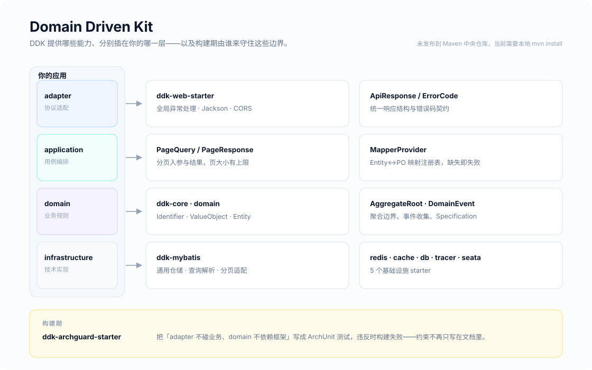
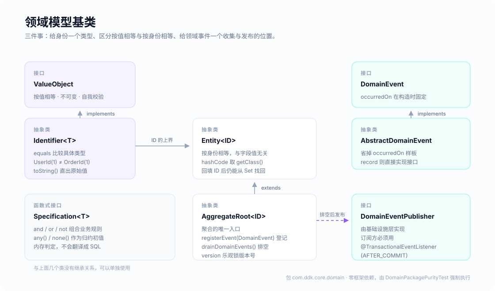
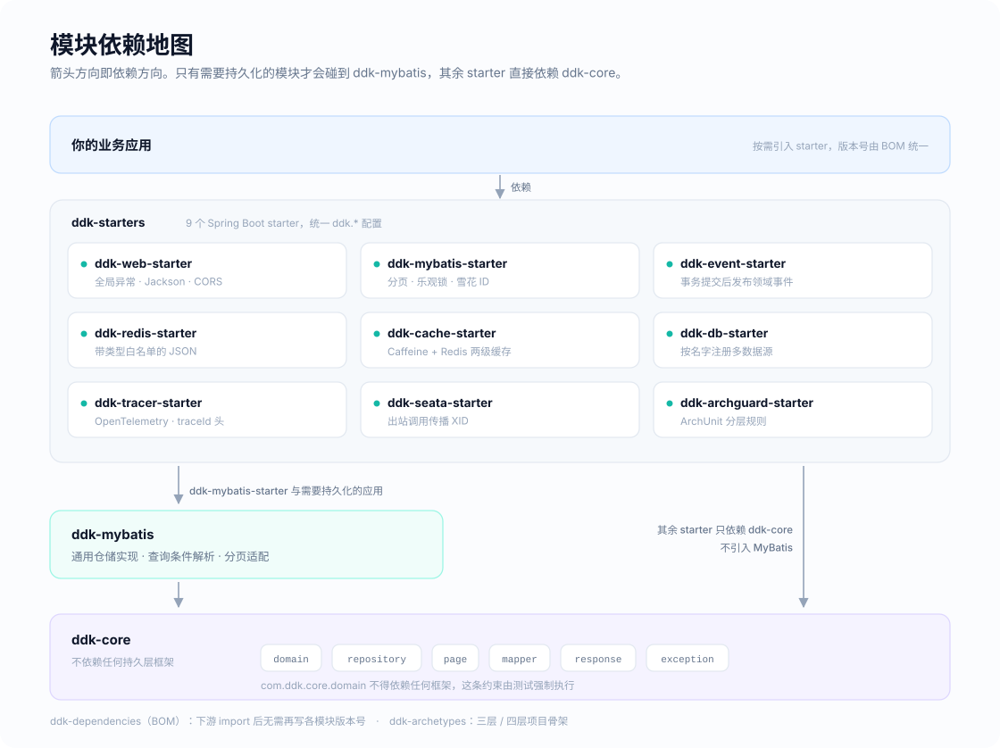
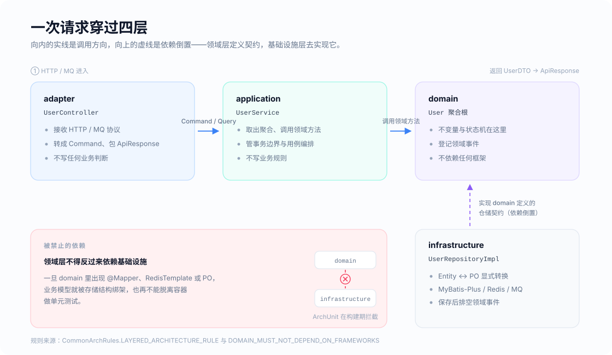

<p align="center">
    
</p>

<h1 align="center">Domain Driven Kit</h1>

<p align="center">
    一个面向 Java / Spring Boot 的 DDD 脚手架与工程约定工具集。
</p>

<p align="center">
    <a href="README_en.md">English</a> ·
    <a href="https://poppycoder.netlify.app/#/docs/ddk/index.md">文档站</a> ·
    <a href="./ROADMAP.md">开发计划</a>
</p>

---

## 项目定位

`domain-driven-kit` 不是一个“大而全”的业务框架，而是一个持续演进的 **Java DDD 工程化工具箱**。它把分层架构、通用响应、异常体系、分页、对象映射、仓储抽象、Spring Boot starter 和架构守卫沉淀成可复用代码，帮助团队把 DDD 从概念落到项目结构和代码约束上。

<p align="center">
    
</p>

适合这些场景：

- 新项目想快速建立清晰的 DDD / 分层架构骨架
- 团队需要统一 Controller、Application、Domain、Infrastructure 的职责边界
- 希望把异常、响应、分页、仓储、对象映射这类重复代码标准化
- 希望用 ArchUnit 把架构规则放进测试和 CI，而不是只写在文档里

## 当前状态

这是一个个人维护中的开源项目，目标是持续补齐工程基线、示例和 starter 能力。目前仓库更适合学习、参考和本地试用，暂未发布到 Maven Central。

| 模块 | 当前能力 | 状态 |
|---|---|---|
| `ddk-core` | 领域模型基类、`ApiResponse`、异常体系、分页对象、Mapper 注册表、仓储契约 | 可用，67 个单测 |
| `ddk-mybatis` | MyBatis-Plus 通用仓储、查询条件解析、分页适配 | 可用，12 个单测 |
| `ddk-web-starter` | Jackson、CORS、全局异常处理 | 可用 |
| `ddk-archguard-starter` | DDD 分层与领域层纯度的 ArchUnit 规则 | 可用 |
| `ddk-dependencies` | BOM，下游 import 后无需再写版本号 | 可用 |
| `ddk-db-starter` | 多数据源动态注册 | 可试用 |
| `ddk-tracer-starter` / `ddk-seata-starter` | 链路追踪 / 分布式事务 | 可试用 |
| `ddk-cache-starter` | 缓存 starter 草案 | 待重写，见[设计推演](https://poppycoder.netlify.app/#/docs/ddk/starters/cache-design.md) |
| `ddk-archetypes` | 四层骨架已可读可测，三层骨架仍是空壳 | 待改造成真正 Maven archetype |
| `ddk-examples` | 示例工程入口 | 待补完整可运行示例 |

## 领域模型

<p align="center">
    
</p>

`com.ddk.core.domain` 只做三件事：

- **给身份一个类型**：`Identifier` 让 `UserId(1)` 不等于 `OrderId(1)`，参数传反在编译期就报错
- **区分按值相等与按身份相等**：`ValueObject`（空接口，`record` 可直接实现）与 `Entity`
- **给领域事件一个收集与发布的位置**：`AggregateRoot` 登记事件，`DomainEventPublisher` 在事务提交后发布

这个包不依赖 Spring、MyBatis、Jackson 或任何框架，这条约束由 `DomainPackagePurityTest` 强制执行，不是写在文档里的君子协定。

基类只提供机制，不强制流程，也不要求整套接受——只想用 `ValueObject` 就只用它。

## 最近更新

- 落地 `com.ddk.core.domain`：`Identifier` / `ValueObject` / `Entity` / `AggregateRoot` / `DomainEvent` / `Specification`
- `MapperProvider` 改用全限定类名做 key，修复不同包的同名类互相覆盖的问题
- 找不到映射器时抛 `MissingMapperException`，不再退回会把数据映射成空对象的 `DefaultMapper`
- `GenericRepository<ID, E>` 收敛为 `<E, ID>`，与 javadoc 和 Spring Data 习惯一致（破坏性变更）
- 四层 archetype 从「跑不通的贫血示例」重写为可读、可测的完整示例
- ArchGuard 新增领域层纯度规则；测试从 14 个增加到 96 个

## 模块结构

<p align="center">
    
</p>

```text
domain-driven-kit
├── ddk-dependencies      BOM，下游 import 后无需再写各模块版本号
├── ddk-core              核心抽象：领域模型、异常、响应、分页、映射、仓储契约
├── ddk-mybatis           MyBatis-Plus 仓储实现与查询适配
├── ddk-starters          Spring Boot starter 集合
│   ├── ddk-web-starter
│   ├── ddk-mybatis-starter
│   ├── ddk-redis-starter
│   ├── ddk-cache-starter
│   ├── ddk-db-starter
│   ├── ddk-tracer-starter
│   ├── ddk-seata-starter
│   └── ddk-archguard-starter
├── ddk-archetypes        三层 / 四层项目骨架
└── ddk-examples          示例工程
```

`ddk-core` 的包结构：

```text
com.ddk.core
├── domain        领域模型基类，零框架依赖
├── repository    GenericRepository 契约
├── page          PageQuery / PageResponse / Sort
├── mapper        MapperProvider 与 @EnhancedMapper
├── response      ApiResponse
└── exception     ErrorCode 与异常体系
```

## 快速开始

环境要求：

- JDK 21
- Maven 3.9+
- Spring Boot 3.4.x

本地构建：

```bash
git clone https://github.com/poppycoderr/domain-driven-kit.git
cd domain-driven-kit
mvn -B -ntp verify
mvn -B install
```

在业务项目中先 import BOM，之后引依赖就不用再写版本号：

```xml
<dependencyManagement>
    <dependencies>
        <dependency>
            <groupId>com.ddk</groupId>
            <artifactId>ddk-dependencies</artifactId>
            <version>1.0.0-SNAPSHOT</version>
            <type>pom</type>
            <scope>import</scope>
        </dependency>
    </dependencies>
</dependencyManagement>

<dependencies>
    <dependency>
        <groupId>com.ddk</groupId>
        <artifactId>ddk-web-starter</artifactId>
    </dependency>
    <dependency>
        <groupId>com.ddk</groupId>
        <artifactId>ddk-mybatis-starter</artifactId>
    </dependency>

    <!-- 架构规则只应出现在测试类路径上 -->
    <dependency>
        <groupId>com.ddk</groupId>
        <artifactId>ddk-archguard-starter</artifactId>
        <scope>test</scope>
    </dependency>
</dependencies>
```

更多完整示例见：[快速开始](https://poppycoder.netlify.app/#/docs/ddk/quickstart.md)。

## 推荐分层

<p align="center">
    
</p>

核心约束：

- `adapter` 只做协议适配，不写业务规则
- `application` 负责编排用例、事务和领域对象调用
- `domain` 保存业务规则，不依赖 Spring、MyBatis、Jackson 等框架
- `infrastructure` 实现领域层定义的仓储和外部依赖接口

这些约束写在文档里只是建议，写成测试才是约束：

```java
class ArchitectureTest {

    private final JavaClasses classes = new ClassFileImporter()
            .withImportOption(ImportOption.Predefined.DO_NOT_INCLUDE_TESTS)
            .importPackages("com.example.myapp");

    @Test
    void layered_architecture_is_respected() {
        CommonArchRules.LAYERED_ARCHITECTURE_RULE.check(classes);
    }

    @Test
    void domain_stays_framework_free() {
        CommonArchRules.DOMAIN_MUST_NOT_DEPEND_ON_FRAMEWORKS.check(classes);
    }
}
```

违反时构建直接失败。完整示例见 `ddk-archetypes/ddk-layer4-archetype`。

## 开发计划

<p align="center">
    
</p>

短期优先级：

1. 规范化 starter 的配置前缀、配置元数据与装配测试
2. 按[设计推演](https://poppycoder.netlify.app/#/docs/ddk/starters/cache-design.md)重写 `ddk-cache-starter`
3. 把 `ddk-archetypes` 改造成真正的 Maven archetype
4. 补一个完整可运行的 `ddk-examples` 示例
5. 给 `ddk-mybatis` 补 H2 集成测试

完整路线图见 [ROADMAP.md](./ROADMAP.md)。

## 文档

- [DDK 文档首页](https://poppycoder.netlify.app/#/docs/ddk/index.md)
- [快速开始](https://poppycoder.netlify.app/#/docs/ddk/quickstart.md)
- [领域模型基类](https://poppycoder.netlify.app/#/docs/ddk/core/domain-model.md)
- [分层约定与架构守卫](https://poppycoder.netlify.app/#/docs/ddk/conventions.md)
- [开发与重构计划](https://poppycoder.netlify.app/#/docs/ddk/contributing.md)

## 贡献

欢迎提交 issue 或 PR。当前项目仍在持续完善中，优先接受这几类贡献：

- 修复 starter 装配和配置问题
- 补测试和最小可运行示例
- 改进 DDD 分层示例和文档
- 对已有设计提出更清晰的工程取舍
