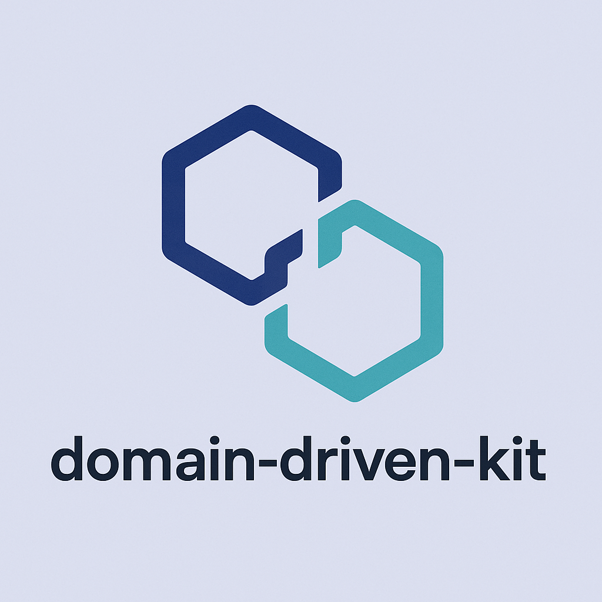

    

<h1 align="center">Domain Driven Kit</h1>

    <em >🧩 — DDD 的模块化、分层架构和领域建模</em>

    <em>⚡ — 脚手架能高效加速项目构建，提高开发效率</em>

    <em>📦 — 可复用的 DDD 代码库和基础设施</em>

<a href="README_en.md">🇺🇸英文</a>

### 🚀 项目简介：

`domain-driven-kit` 🛠️ 是一个基于 Java 的开源脚手架项目，旨在帮助开发者快速构建基于 DDD (领域驱动设计) 思想的分层架构应用，**专注于解决 DDD 概念抽象、难以落地的问题，并提供一套标准、可复用的架构模式，帮助团队统一开发规范。**

### ✨ 主要特性：

*   **🧱 标准 DDD 四层项目结构:** 基于经典的四层架构（用户接口层、应用层、领域层、基础设施层），提供清晰的职责划分和依赖管理。
*   **🎈 轻量 DDD 三层项目结构:** 保留四层架构中的用户接口层和基础设施层，将应用层和领域层合并成业务逻辑层，三层架构将更适用于简单项目的构建。
*   **📦 预配置的 Spring Boot Starter:** 方便快速集成常用的组件，包括：数据访问、事务管理、日志、验证等，并提供默认配置方案，简化开发配置。
*   **💡 最佳实践的 DDD 架构示例:** 提供一个基于用户管理的示例，展示 DDD 的核心概念：实体、值对象、聚合、领域服务、仓储等，帮助开发者快速理解和应用 DDD 思想。
*   **⚡  快速原型开发:** 可以基于脚手架快速生成 DDD 项目骨架，用于快速原型验证。
*   **🤝 统一团队规范:** 提供标准架构模式，帮助团队统一开发规范。
*   **⚙️ 可扩展性:** 可以根据实际业务需求进行自定义扩展。

### 🎯 项目目标：

*   **🌱 降低 DDD 实践门槛：** 让 DDD 初学者也能快速上手，并应用于实际项目。
*   **🚀 提高开发效率：** 通过预配置和代码示例，减少重复开发，提高开发效率。
*   **👨‍💻 统一团队规范：** 提供一套标准的 DDD 架构，帮助团队统一开发规范。

### 🤔 解决的痛点：

*   😫 DDD 概念抽象，难以落地？
*   😵‍💫 分层架构繁琐，需要大量配置？
*   🧐 找不到合适的 DDD 实践案例？

### 🛠️ 如何使用：

1.  [提供详细的快速入门步骤]
2.  [提供代码示例]
3.  [提供 Spring Boot Starter 的配置说明]

### 🏛️ 架构：

* 🧱[DDD 四层架构](./ddk-archetypes/ddk-layer4-archetype/README.md)

    

* 🎈[DDD 三层架构](./ddk-archetypes/ddk-layer3-archetype/README.md)

    

### 📚 文档：

*   [详细文档](https://poppycoder.netlify.app)

### 🤝 贡献：

*   欢迎提交 PR 和反馈问题！

### 💬 社区：

*   [TODO]

### 🗓️ 维护计划：

| 阶段                       | 任务                                             | 状态   | 完成时间       | 提交人       | 备注                    |
|--------------------------|------------------------------------------------| ------ |------------|-----------|-----------------------|
| 项目初始化 (🐣)               | 创建基础项目结构和 Maven 配置 🏗️️                        | ✅     | 2025-01-09 | Elijah Du |                       |
|                          | 引入代码风格规范和质量检查，架构守护等工具 (如：Archunit，Checkstyle, PMD, SonarLint) 🎨 | ❌     |            |           |                       |
|                          | 基础依赖和工具库，统一相关依赖版本与结构 (如：Lombok, MapStruct) 📚  | 🚧     |            |   Elijah Du        |                       |
| 核心模块完善 (✨)               | 通用返回模块: 提供统一的 API 返回格式，包括状态码、消息和数据，方便客户端处理 📦  | ✅     | 2025-02-08 | Elijah Du          |                       |
|                          | 异常模块: 定义统一的异常处理机制，包括自定义异常类、全局异常处理器等，提高系统的健壮性 ❗ | ✅     | 2025-02-08 |  Elijah Du         |                       |
|                          | 分页模块: 提供通用的分页查询功能，支持多种分页方式，简化分页逻辑的开发 📄        | ✅     | 2025-02-10 |  Elijah Du         |                       |
|                          | 映射模块: 基于 MapStruct 或其他映射框架，实现对象之间的自动转换，减少手动编写映射代码 🗺️ | 🚧     |            |  Elijah Du         |                       |
|                          | 持久层模块: 封装常用的数据库操作，提供统一的数据访问接口，降低数据库访问的复杂度 🗄️  | ✅     | 2025-02-11 |  Elijah Du         |                       |
| 四层架构开发 (🏢)              | 适配层 (Adapter Layer)：以 User 为基础，实现 Web 增删改查接口 🌐 | 🚧     |            |      Elijah Du     |                       |
|                          | 应用层 (Application Layer)：实现领域层，基础设施层的编排调用 ⚙️    | 🚧     |            |    Elijah Du       |                       |
|                          | 领域层 (Domain Layer)：实现领域模型，以及业务规则的最佳实践 🧠       | 🚧     |            |    Elijah Du       |                       |
|                          | 基础设施层 (Infrastructure Layer)：实现数据访问、缓存、消息传递等 🛠️ | 🚧     |            |    Elijah Du       |                       |
| 三层架构开发 (🏢)              | 基于四层架构进行简化，合并应用层和领域层为业务逻辑层 🤝                  | ❌     |            |           |                       |
| Starter 封装 (📦)          | 封装 Starters，以简化配置和使用，提升开发效率 ⚡                  | 🚧     |            |           |                       |
| *ddk-web-starters*       | 简化 Web 的配置，提供常用的配置以及异常处理，通用返回等 🌐       | 🚧     |            |  Elijah Du         |                       |
| *ddk-archguard-starters* | 简化 ArchUnit 的配置和集成，预定义分层架构约束，轻松实现架构守护和合规检查 🛡️ | ❌     |            |           |                       |
| *ddk-db-starters*        | 简化多数据源的配置和管理 🗄️                        | ❌     |            |           |                       |
| *ddk-seata-starters*     | 简化分布式事务 Seata 的配置和使用，提供分布式事务的解决方案 ⚙️    | ❌     |            |           |                       |
| *ddk-remote-starters*    | 简化远程服务调用的配置和使用，集成 Feign，RestTemplate 等 📞 | ❌     |            |           |                       |
| *ddk-cache-starters*     | 集成 Redis、Caffeine 实现多级缓存方案，提供缓存的简化配置和使用 ⚡ | ❌     |            |           |                       |
| *ddk-locker-starters*    | 提供分布式锁的简化配置和使用，支持 Redis、ZooKeeper 等多种实现 🔒 | ❌     |            |           |                       |
| *ddk-limiter-starters*   | 提供限流功能的简化配置和使用，支持计数器、令牌桶、漏桶等多种算法 🚦     | ❌     |            |           |                       |
| *ddk-mq-starters*        | 简化消息队列的配置和使用，支持 RabbitMQ、Kafka 等多种消息队列 ✉️ | ❌     |            |           |                       |
| *ddk-es-starters*        | 简化 Elasticsearch 客户端的配置和使用，提供常用的查询和索引操作 🔍 | ❌     |            |           |                       |
| *ddk-monitor-starters*   | 简化监控指标的配置和集成，提供常用的监控面板和告警规则 📊          | ❌     |            |           |                       |
| *ddk-tracer-starters*    | 简化链路追踪的配置和集成，支持主流的链路追踪系统，如 SkyWalking、Jaeger、Zipkin 🔗 | ❌     |            |           |                       |
| *ddk-schedule-starters*  | 简化分布式任务调度的配置和使用，支持 Cron 表达式、定时任务管理等功能 ⏰ | ❌     |            |           |                       |
| *ddk-auth-starters*      | 提供认证和授权的简化配置和使用，支持 OAuth2、JWT 等多种认证方式 🔑 | ❌     |            |           |                       |
| *ddk-ai-starters*        | 简化 AI 框架配置，支持 SpringAI，Langchain 等多种模式 🤖 | ❌     |            |           |                       |
| *to be continue*         | ...                              | ❌     |            |           |                       |
| 持续更新 (♻️)                | 根据最佳实践，优化代码结构和性能 👓                            | 🔄     |            |           |                       |
|                          | 提升测试覆盖率，确保代码质量 ✅                               | 🔄     |            |           |                       |
|                          | 完善项目文档，确保开发者更好地理解项目 📜                         | 🔄     |            |           |                       |
|                          | 持续优化项目依赖，保持项目依赖的最新状态 ⬆️                        | 🔄     |            |           |                       |
|                          | 持续探索和集成 Spring Boot 生态系统中优秀的、常用的组件 🚀          | 🔄     |            |           |                       |

**状态说明：**

*   ✅：完成
*   🚧：开发中
*   ❌：未开始
*   🔄: 持续进行

`domain-driven-kit` 致力于降低 DDD 的学习和实践门槛，让开发者能够更专注于业务逻辑的实现，并提升开发效率。🚀