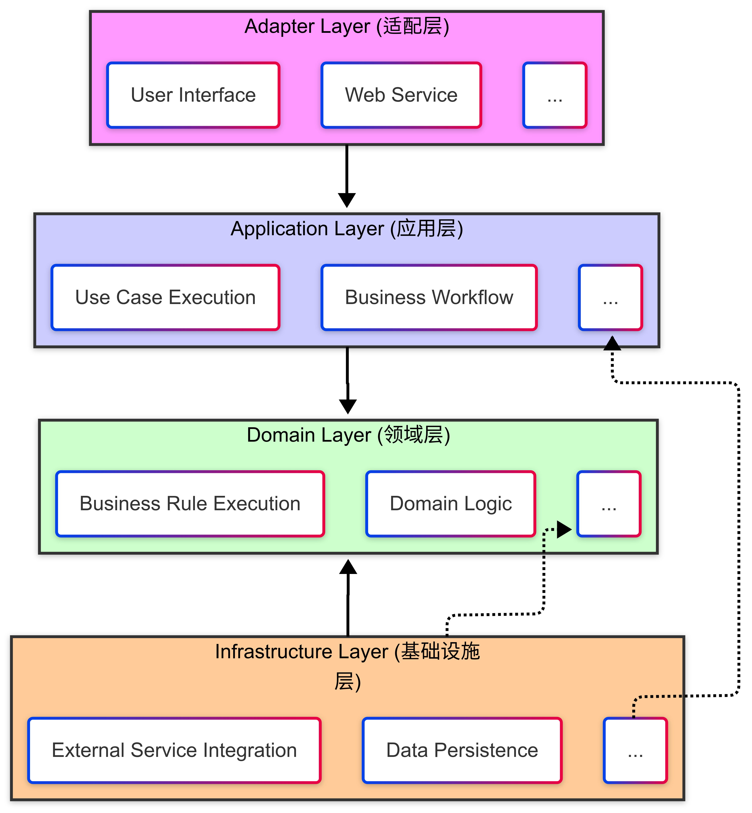
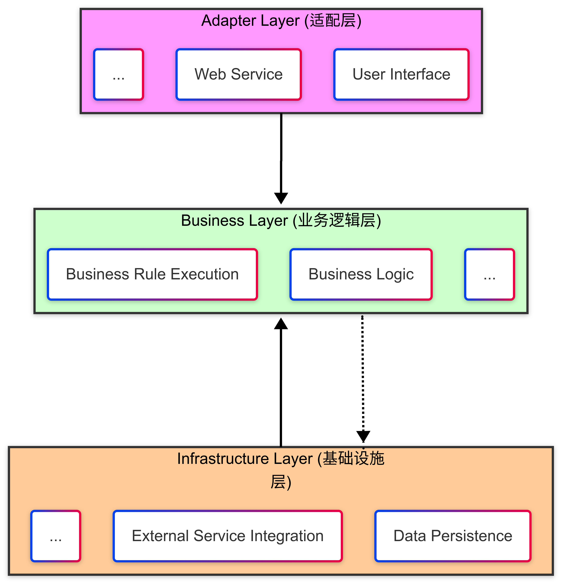

    

<h1 align="center">Domain Driven Kit</h1>

    <em >🧩 — Modularization, layered architecture, and domain modeling in DDD</em>

    <em>⚡ — The scaffold efficiently accelerates project construction and enhances development productivity</em>

    <em>📦 — Reusable DDD codebase and infrastructure</em>

<a href="README.md">🇨🇳中文</a>

### 🚀 Project Introduction:

`domain-driven-kit` 🛠️ is an open-source scaffolding project built with Java, designed to help developers quickly construct layered applications based on Domain-Driven Design (DDD) principles. **It focuses on addressing the abstraction and implementation challenges of DDD, providing a standard and reusable architectural pattern to help teams unify their development practices.**

### ✨ Key Features:

*   **🧱 Standard DDD 4-Layered Project Structure:** Based on the classic four-layer architecture (User Interface, Application, Domain, and Infrastructure), providing clear responsibility separation and dependency management.
*   **🎈 Lightweight DDD 3-Layered Project Structure:** Retains the user interface layer and infrastructure layer from the four-layer architecture, merging the application layer and domain layer into a business logic layer. This three-layer architecture is better suited for building simple projects.
*   **📦 Pre-configured Spring Boot Starter:** Facilitates the rapid integration of common components, including data access, transaction management, logging, and validation, with default configurations to simplify development setup.
*   **💡 Best Practices DDD Architectural Example:** Offers a user management example showcasing core DDD concepts such as Entities, Value Objects, Aggregates, Domain Services, and Repositories, helping developers quickly understand and apply DDD principles.
*   **⚡ Rapid Prototyping:** Enables the quick generation of a DDD project skeleton for rapid prototype verification.
*   **🤝 Unified Team Standards:** Provides a standard architectural pattern to help teams unify their development standards.
*   **⚙️ Extensibility:** Allows for custom extensions based on specific business needs.

### 🎯 Project Goals:

*   **🌱 Lower the Barrier to DDD Practice:** Empowering DDD beginners to quickly get started and apply it to real-world projects.
*   **🚀 Increase Development Efficiency:** Reduce repetitive development through pre-configurations and code examples, thus enhancing efficiency.
*   **👨‍💻 Unify Team Standards:** Provide a standardized DDD architecture to help teams establish uniform development practices.

### 🤔 Pain Points Addressed:

*   😫  DDD concepts are abstract and difficult to implement?
*   😵‍💫 Layered architecture is cumbersome and requires extensive configuration?
*   🧐  Finding appropriate DDD practical examples is challenging?

### 🛠️ How to Use:

1.  [Provide detailed quick start steps]
2.  [Provide code examples]
3.  [Provide Spring Boot Starter configuration instructions]

### 🏛️ Architectural Example:

* 🧱[4-layer](./ddk-archetypes/ddk-layer4-archetype/README.md)

    

* 🎈[3-layer](./ddk-archetypes/ddk-layer3-archetype/README.md)

    

### 📚 Documentation:

*   [ddk.doc](https://poppycoder.netlify.app)

### 🤝 Contributing:

*   Contributions and feedback are welcome! Feel free to submit PRs and issues.

### 💬 Community:

*   [Link to discussion forum]

### 🗓️ Maintenance Plan:

*   [Describe the maintenance plan]

`domain-driven-kit` is committed to lowering the learning curve and implementation challenges of DDD, allowing developers to focus more on business logic and improve development efficiency. 🚀