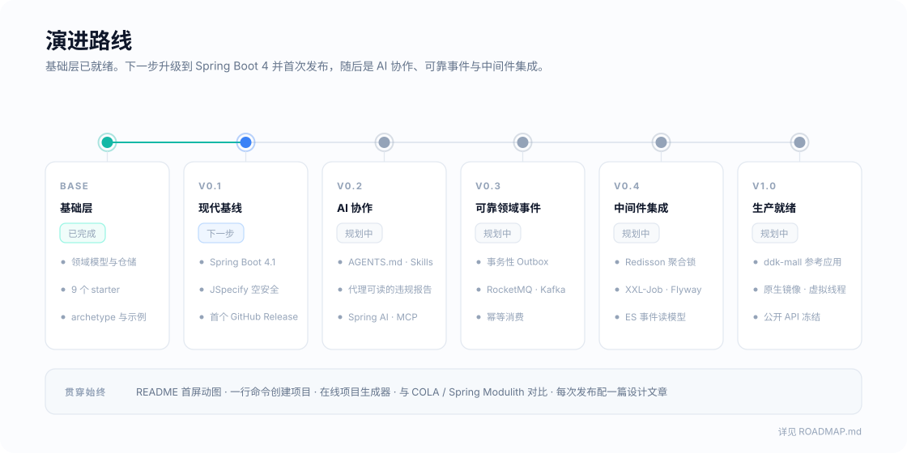

# DDK Roadmap

This roadmap keeps the repository honest: what already works, what was recently fixed, and what should be improved next.

  

## Done Recently

- Added CI with Maven verify
- Fixed reactor build failures caused by broken tests and starter context issues
- Fixed `ddk-web-starter` global exception handling by registering `BaseExceptionHandler` as `@RestControllerAdvice`
- Added a default max page size to `PageQuery`
- Fixed pagination sorting so `PageQuery.addSort()` reaches MyBatis-Plus
- Tightened the ArchUnit layered rule to prevent Domain from depending on Infrastructure
- Reworked public README files to expose project state, limitations and next steps

## Phase 1 - Engineering Baseline

Goal: make the project easier to build, review and maintain.

- Fill `ddk-dependencies` as a real BOM
- Add Spotless or Checkstyle for formatting
- Add JaCoCo thresholds after core tests are in place
- Add `spring-boot-configuration-processor` and starter metadata
- Remove generated `target/` artifacts and classpath-sensitive resources from library modules

## Phase 2 - Core DDD Model

Goal: make `ddk-core` useful beyond response and pagination helpers.

- Add `Identifier`
- Add `ValueObject`
- Add `Entity`
- Add `AggregateRoot`
- Add `DomainEvent`
- Add `Specification`
- Add focused unit tests for invariants and equality behavior

## Phase 3 - Mapper and Repository Safety

Goal: fail early when mapping is unsafe.

- Replace `DefaultMapper` fallback with explicit failure for missing Entity <-> PO mappers
- Use fully qualified class names for mapper keys to avoid same-simple-name collisions
- Add tests for missing mapper, duplicate mapper and list mapping
- Add `ddk-mybatis` integration tests with H2
- Review `GenericRepository<ID, E>` generic order and document the compatibility decision

## Phase 4 - Starter Normalization

Goal: make every starter predictable in production projects.

- Give every starter a dedicated `ddk.*` configuration prefix
- Add `additional-spring-configuration-metadata.json`
- Replace hard-coded CORS defaults with configurable properties
- Remove `logback-spring.xml` from `ddk-web-starter` or move it to examples
- Rewrite `ddk-cache-starter` around a real multi-level cache design
- Add `ApplicationContextRunner` tests for Web, Redis, MyBatis, Cache, DB, Tracer and ArchGuard starters

## Phase 5 - Archetypes and Examples

Goal: let users try DDK without reading every document first.

- Convert `ddk-archetypes` into real Maven archetypes
- Add a runnable 4-layer user-management example
- Add a lightweight 3-layer example
- Add README-driven smoke test commands for examples
- Keep examples aligned with codesphere documentation

## Phase 6 - Release Readiness

Goal: prepare for a public artifact release only after the API settles.

- Stabilize package names and public contracts
- Add semantic versioning policy
- Add release notes
- Add javadocs for public APIs
- Decide whether to publish to Maven Central

## Non-Goals For Now

- No Maven Central publishing until examples and tests are reliable
- No attempt to compete with full application frameworks
- No hidden magic in domain model classes; domain code should remain plain Java first
