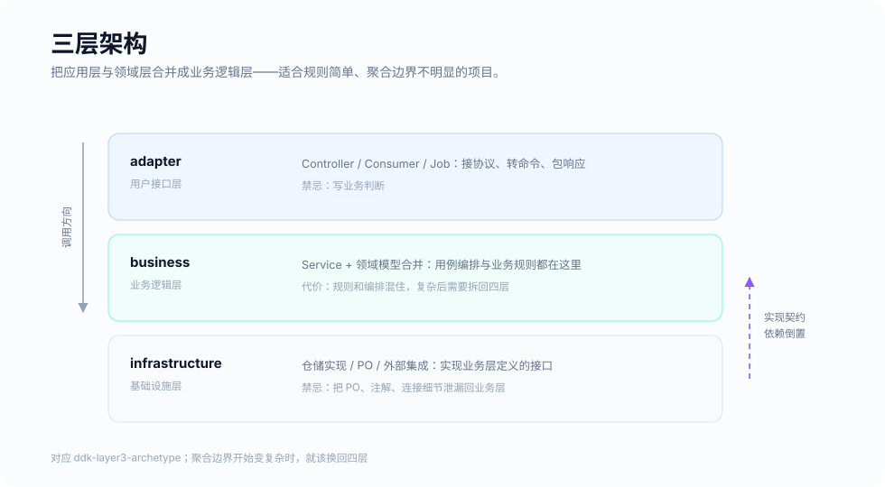

# 三层架构骨架 (ddk-layer3-archetype)

用 `mvn archetype:generate` 生成一个三层架构的 Spring Boot 服务：包结构、H2 开箱配置、上下文启动测试与架构守卫测试都已就位，没有需要删除的示例代码。



三层是四层合并了应用层与领域层之后的结果，适用于业务规则简单的服务：层间转换更少、结构更扁平。代价是用例编排与业务规则住在同一层，分支增多后 Service 会迅速变长。**当你开始需要为「什么时候允许改这个字段」写注释时，就该换回四层。**

## 生成项目

DDK 尚未发布到 Maven 中央仓库，先在 DDK 仓库根目录安装到本地：

```bash
mvn install -DskipTests
```

再在任意目录生成：

```bash
mvn archetype:generate \
  -DarchetypeGroupId=com.ddk \
  -DarchetypeArtifactId=ddk-layer3-archetype \
  -DarchetypeVersion=0.2.0-SNAPSHOT \
  -DgroupId=com.acme \
  -DartifactId=order-service \
  -Dpackage=com.acme.order \
  -DinteractiveMode=false
```

```bash
cd order-service
mvn verify
mvn spring-boot:run
```

| 参数 | 默认值 | 说明 |
|---|---|---|
| `groupId` / `artifactId` / `version` | — | 生成项目的坐标 |
| `package` | `groupId` | 根包名 |
| `ddkVersion` | 骨架自身的版本 | 生成项目引用的 DDK 版本，通过 `ddk-dependencies` BOM 管理 |
| `springBootVersion` | DDK 使用的 Spring Boot 版本 | 生成项目的 `spring-boot-starter-parent` 版本 |

## 生成的内容

```text
${package}
├── Application
├── adapter.controller           REST 控制器与 *Request
├── business
│   ├── command / query          用例入参
│   ├── response                 *Response.from(...)
│   ├── service                  业务服务：编排与事务
│   ├── model                    实体、值对象、枚举
│   ├── event / handler          业务事件与订阅方
│   ├── acl                      仓储与外部能力接口
│   └── error                    业务错误码
└── infrastructure
    ├── acl.impl                 接口实现
    ├── converter                实体 ↔ PO
    └── orm.po / orm.mapper      持久化对象与 Mapper
```

| 文件 | 作用 |
|---|---|
| `package-info.java` | 每个包一份，写明这个包放什么、命名约定是什么 |
| `ArchitectureTest` | 用 `CommonArchRules.THREE_LAYER_ARCHITECTURE_RULE` 校验依赖方向，违反即构建失败；空的层不会导致失败 |
| `ApplicationTest` | 上下文能否启动 |
| `AGENTS.md` / `CLAUDE.md` | 写给 AI 编码代理的分层职责、编码约定与完成标准，Claude Code、Codex 会自动读取 |
| `.claude/skills/` | Claude Code Skills：`ddk-add-feature` |
| `application.yml` | 内存 H2 与 `ddk.mybatis.db-type=h2`，开箱即可启动 |

依赖：`ddk-web-starter`、`ddk-mybatis-starter`、`ddk-event-starter`，测试期 `ddk-archguard-starter`。一个完整的业务用例怎么落在这些包里，见 [`ddk-examples/ddk-example-user`](../../ddk-examples/ddk-example-user)。

## 开发这个骨架

模板位于 `src/main/resources/archetype-resources`，由 Velocity 在生成时渲染（`${package}`、`${artifactId}` 等）。Markdown 模板里 `##` 是 Velocity 注释，二级、三级标题要写成 `$h2`、`$h3`。集成测试会用 `src/test/resources/projects/basic` 的参数生成一个项目并对它执行 `mvn verify`：

```bash
mvn install -Parchetype-it
```

它需要 DDK 各模块已安装到本地仓库，所以默认跳过，CI 始终开启。
