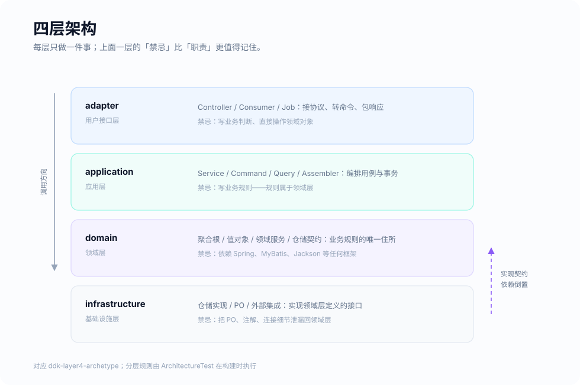

# 四层架构骨架 (ddk-layer4-archetype)

一个基于 Spring Boot 的四层架构参考实现。它不是「目录结构示例」——每个类都在演示一个具体的取舍，可以直接抄进真实项目。

> 注意：这个模块目前还不是可用的 Maven archetype，需要手工复制。改造成真正的 archetype 是[路线图](../../ROADMAP.md)的第 5 阶段。

## 架构设计



依赖方向永远向内，只有一个例外：基础设施层通过实现领域层定义的 `ACL`（防腐层）接口反向依赖领域层。这就是依赖倒置——领域层说「我需要能存取用户」，但不关心背后是 MySQL 还是别的什么。

这四条边界不是靠自觉维持的，`ArchitectureTest` 会在每次构建时检查，违反即失败。

## 这个骨架在演示什么

| 文件 | 演示的取舍 |
|---|---|
| `domain/model/entity/User` | 聚合根：没有公开构造器和 setter，创建走工厂方法，状态机约束写在实体里而不是 Service 的 if 里 |
| `domain/model/entity/UserId` | 类型化标识：`transfer(userId, accountId)` 参数传反会在编译期报错 |
| `domain/model/valueobject/PhoneNumber` | 值对象用 `record`：不可变、按值相等、构造期自我校验一次满足；格式校验放在这里而不是 Command 的注解上，注解只能拦住 HTTP 入口 |
| `domain/event/*` | 两种事件写法：`record` 显式带 `occurredOn`，或继承 `AbstractDomainEvent` 省掉样板 |
| `domain/service/PasswordEncryptionService` | 领域服务是接口：领域层定契约，基础设施层给实现，领域层不依赖任何加密库 |
| `domain/acl/UserRepository` | 仓储契约放在领域层，实现放在基础设施层 |
| `infrastructure/converter/*` | Entity↔PO 手写转换器，两个方向各注册一次。没有注册就在查找时抛异常，不会静默返回空对象 |
| `infrastructure/acl/impl/UserRepositoryImpl` | 保存后排空领域事件；`drainDomainEvents()` 把「复制 + 清空」做成一步 |
| `application/handler/UserRegisteredHandler` | `@TransactionalEventListener(AFTER_COMMIT)` 而不是 `@EventListener`——事件必须在事务提交后发布 |
| `application/service/UserService` | 应用服务只做「取出聚合、调用领域方法、保存、装配返回」，没有一行业务规则 |
| `application/assembler/UserAssembler` | 出站装配在应用层，顺带做手机号脱敏——这正是不把领域对象直接扔给 Jackson 的理由 |
| `ArchitectureTest` | 分层规则写成测试，是这个骨架最该被抄走的文件 |

## 项目结构

```text
com.ddk
├── adapter (适配层)
│   ├── controller      REST 控制器，只接协议、转命令、包响应
│   └── consumer        消息消费者
├── application (应用层)
│   ├── service         应用服务，编排用例与事务
│   ├── command         命令对象（写操作 xxxCommand）
│   ├── query           查询对象（读操作 xxxQuery）
│   ├── handler         领域事件订阅方
│   ├── assembler       领域对象 -> 对外 DTO 的装配
│   ├── response        对外响应对象（xxxDTO）
│   └── acl             调用外部服务的防腐层接口（xxxGateway）
├── domain (领域层)              ← 不依赖任何框架
│   ├── model
│   │   ├── entity        实体与聚合根、类型化标识
│   │   ├── valueobject   值对象（推荐用 record）
│   │   └── enums         枚举（实现 IEnum 以获得映射能力）
│   ├── service         领域服务，无状态、跨实体的领域行为
│   ├── event           领域事件（xxxEvent，命名用过去式）
│   ├── error           领域错误码（实现 ErrorCode）
│   └── acl             仓储契约（xxxRepository）
└── infrastructure (基础设施层)
    ├── acl/impl        领域层与应用层接口的实现
    ├── converter       Entity ↔ PO 显式转换器
    ├── event           DomainEventPublisher 的 Spring 实现
    ├── security        领域服务的技术实现
    ├── orm
    │   ├── po          持久化对象（xxxPO，数据库表的镜像）
    │   └── mapper      MyBatis Mapper（xxxMapper）
    ├── redis           Redis 相关实现
    └── remote          远程调用客户端
```

`entity` 与 `po` 刻意分开：PO 是贫血的、可变的、带框架注解的，这些特征对 PO 来说全是正确的。领域模型的形状由业务决定，PO 的形状由表决定。

## 配套的表结构

```sql
CREATE TABLE `user` (
    `id`           BIGINT       NOT NULL AUTO_INCREMENT,
    `username`     VARCHAR(20)  NOT NULL,
    `password`     VARCHAR(128) NOT NULL,
    `gender`       INT          NOT NULL,
    `email`        VARCHAR(64)  DEFAULT NULL,
    `phone_number` VARCHAR(11)  NOT NULL,
    `status`       TINYINT(1)   NOT NULL DEFAULT 1,
    `version`      BIGINT       NOT NULL DEFAULT 0,
    PRIMARY KEY (`id`),
    UNIQUE KEY `uk_username` (`username`)
);
```

`version` 对应 `AggregateRoot.version()`，由 MyBatis-Plus 的乐观锁插件维护——并发控制的单位是聚合，不是聚合内的单个实体。

## 已知限制

- `Sha256PasswordEncryptionService` 是示例实现，没有加盐也没有慢哈希因子，生产环境请换成 BCrypt / Argon2
- `SpringDomainEventPublisher` 暂时放在这个骨架里，等契约稳定后会收进 DDK 的 starter
- 还没有 schema 初始化脚本与可直接运行的冒烟命令
