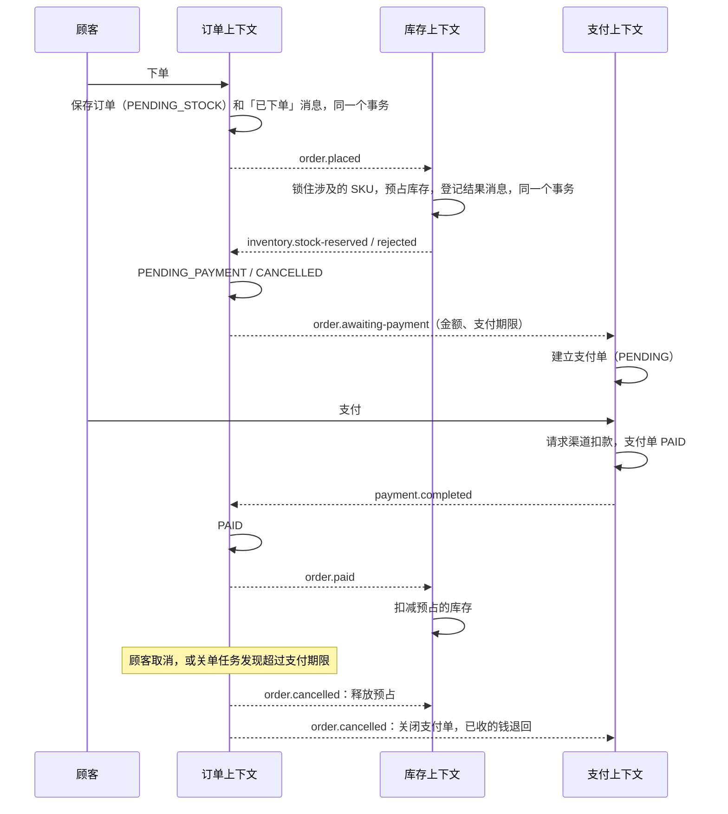

# 参考应用：商城 (ddk-mall)

用一个完整的业务场景把 DDK 的各个 starter 串起来：下单 → 预占库存 → 支付 → 完成，超时未支付则取消并释放库存。订单、库存、支付三个限界上下文部署成一个应用（模块化单体），上下文之间只通过集成事件协作。

这个应用分步建设，目前完成了前 5 步：业务链路已经连通，读侧有缓存，接口有文档，用例可以被 AI agent 通过 MCP 调用。

| 步骤 | 内容 | 状态 |
|---|---|---|
| 1 | 骨架、订单上下文（下单、查询、取消）、Flyway、MySQL | 已完成 |
| 2 | 库存上下文：预占、释放、扣减，按 SKU 加锁 | 已完成 |
| 3 | 订单与库存之间的消息：outbox、RocketMQ、幂等消费 | 已完成 |
| 4 | 支付上下文（模拟渠道）、超时关单 | 已完成 |
| 5 | 缓存、接口文档、MCP 工具 | 已完成 |
| 6 | 可观测性、整体文档 | 未开始 |

## 运行

默认使用内存 H2，不依赖任何外部组件：

```bash
mvn -pl ddk-examples/ddk-mall -am install -DskipTests
mvn -pl ddk-examples/ddk-mall spring-boot:run
```

连接真实的 MySQL、Redis 和 RocketMQ：

```bash
docker compose -f ddk-examples/ddk-mall/docker-compose.yml up -d
mvn -pl ddk-examples/ddk-mall spring-boot:run -Dspring-boot.run.profiles=compose
```

表结构由 Flyway 在启动时创建，并带三件商品和它们的库存：`SKU-KEYBOARD`（10 件）、`SKU-MOUSE`（50 件）、`SKU-MONITOR`（3 件）。

默认 profile 排除了 Spring Boot 的 Redis 自动配置，应用里没有任何 Redis 连接。两种运行方式有四处差别，业务代码完全相同：

| | 默认 profile | `compose` profile |
|---|---|---|
| 库存锁 | 进程内的锁，只适合单实例，启动时打一条警告 | Redis，多个实例之间互斥 |
| 定时任务的锁 | 总是放行的替身（`LocalJobLock`），只适合单实例 | Redis，多个实例里同一轮只有一个执行 |
| 缓存 | 只有进程内的一级（Caffeine） | 商品两级（Caffeine + Redis），库存只用 Redis |
| 上下文之间的消息 | DDK 的进程内转发（`ddk.event.local-delivery`），进程退出就丢，失败不重投 | 先写进事件发布记录，提交后经 RocketMQ 投递，失败可重投 |

## 冒烟命令

示例不做登录认证，顾客身份放在请求头 `X-Customer-Id` 里。

```bash
# 下单：只传 SKU 和数量，名称与单价取自商品目录。返回的状态是 PENDING_STOCK
curl -s -X POST localhost:8080/orders -H 'X-Customer-Id: 7' -H 'Content-Type: application/json' \
  -d '{"lines":[{"skuId":"SKU-KEYBOARD","quantity":1},{"skuId":"SKU-MOUSE","quantity":2}]}'

# 查询自己的订单（把 <id> 换成上一步返回的订单号）。库存预占完成后状态变成 PENDING_PAYMENT
curl -s localhost:8080/orders/<id> -H 'X-Customer-Id: 7'

# 库存已经被这个订单预占
curl -s localhost:8080/inventory/SKU-KEYBOARD

# 下一个超出库存的订单：稍后查询，状态是 CANCELLED，取消原因是库存不足
curl -s -X POST localhost:8080/orders -H 'X-Customer-Id: 7' -H 'Content-Type: application/json' \
  -d '{"lines":[{"skuId":"SKU-MONITOR","quantity":99}]}'

# 库存预占完成后支付上下文建好了支付单：查看应付金额和支付期限
curl -s localhost:8080/payments/orders/<id> -H 'X-Customer-Id: 7'

# 支付（模拟渠道，单笔不超过 50000 都成功）。稍后查询订单，状态是 PAID，库存的在库数量随之减少
curl -s -X POST localhost:8080/payments/orders/<id>/pay -H 'X-Customer-Id: 7'

# 换一个顾客查同一个订单：ORDER_NOT_FOUND，不透露订单是否存在
curl -s localhost:8080/orders/<id> -H 'X-Customer-Id: 8'

# 我的订单
curl -s -X POST localhost:8080/orders/page -H 'X-Customer-Id: 7' -H 'Content-Type: application/json' -d '{}'

# 取消还没支付的订单，预占的库存随之释放，支付单关闭；再取消一次或取消已支付的订单返回 ORDER_NOT_CANCELLABLE
curl -s -X POST localhost:8080/orders/<id>/cancel -H 'X-Customer-Id: 7' -H 'Content-Type: application/json' \
  -d '{"reason":"不想要了"}'
```

下单后 30 分钟没有支付，订单会被关单任务取消（每 30 秒扫描一次）。想马上看到效果，启动时把期限调短：

```bash
mvn -pl ddk-examples/ddk-mall spring-boot:run -Dspring-boot.run.arguments="--mall.order.payment-timeout=1m --mall.order.close-interval=5s"
```

库存的预占和释放由订单的消息驱动，下面的接口用于运营操作和手工验证：

```bash
# 查库存：在库、已预占、可售
curl -s localhost:8080/inventory/SKU-MONITOR

# 为订单 1001 预占；任何一行库存不足，整单都不占
curl -s -X POST localhost:8080/inventory/reservations -H 'Content-Type: application/json' \
  -d '{"orderId":1001,"lines":[{"skuId":"SKU-MONITOR","quantity":2},{"skuId":"SKU-MOUSE","quantity":1}]}'

# 订单支付后扣减，或订单取消后释放；两者都可以重复调用
curl -s -X POST localhost:8080/inventory/reservations/1001/confirm
curl -s -X POST localhost:8080/inventory/reservations/1001/release

# 补货
curl -s -X POST localhost:8080/inventory/SKU-MONITOR/restock -H 'Content-Type: application/json' -d '{"quantity":5}'
```

## 接口文档

启动后打开 `http://localhost:8080/swagger-ui.html`。文档按限界上下文分成三组（右上角切换），对应 `/v3/api-docs/order`、`/v3/api-docs/inventory`、`/v3/api-docs/payment`。每一组都带统一的错误响应和全部错误码的清单，这部分由 DDK 的 Web starter 自动补上。

## 给 AI agent 用：MCP 工具

应用在 `/mcp` 上提供 MCP 服务（streamable HTTP），面向客服场景开放了五个工具：

| 工具 | 作用 |
|---|---|
| `get_order` | 查顾客的一个订单 |
| `cancel_order` | 替顾客取消还没支付的订单 |
| `get_payment` | 查订单的支付情况 |
| `get_stock` | 查一个 SKU 的库存 |
| `get_order_reservations` | 查订单占用的库存 |

在 Claude Code 里接入：

```bash
claude mcp add --transport http ddk-mall http://localhost:8080/mcp
```

工具和接口调用同一个应用服务，业务规则只有一份：agent 用别的顾客 ID 查订单同样得到 `ORDER_NOT_FOUND`。只开放了查询和取消；发起支付、补货这类操作没有做成工具。示例没有做认证，真实项目里 `/mcp` 要和其他接口一样用 Spring Security 保护。

## 上下文怎么协作



虚线都是消息：先和业务数据在同一个事务里登记，提交后经 RocketMQ 投递（默认 profile 下在进程内转发）。


- **上下文互不调用。** 订单不知道库存和支付的存在，只是发出「已下单」「等待支付」「已支付」「已取消」；库存和支付不认识订单的类型，各自定义一份只含所需字段的消息体。支付单需要的金额和期限随消息带过去，支付上下文不回头查订单。
- **消息不会丢。** 消息和业务数据在同一个事务里提交（DDK 的事件 starter 加 Spring Modulith 的事件发布记录），提交之后才投递，投递失败的记录可以重投。
- **重复投递不会重复处理。** 预占用 `IdempotentConsumer` 按消息 ID 去重，并且去重登记和预占在同一个事务里；订单的状态流转和库存的释放本身可以重复执行，不需要额外去重。
- **不依赖消息的先后。** 消息以订单号为 key，同一个订单的消息在同一个队列里，但提交后的投递是并发的，「已取消」有可能比「已下单」先到库存上下文：那时还没有预占，什么都没释放，随后「已下单」又把库存占上了。所以订单上下文收到「库存已预占」时如果订单已经取消，会再发一次「已取消」，把这次晚到的预占释放掉。
- **订单说了算。** 付款和取消可能同时发生：顾客付了款，订单却刚好被取消或超时关闭。订单的状态由乐观锁保证只走一条路，另外两个上下文跟随它：订单最终是已支付，库存扣减；订单最终是已取消，库存释放，支付单关闭，已经收到的钱退回。订单上下文收到「支付已完成」时如果订单已经取消，会再发一次「已取消」来触发退款。
- **请求渠道不靠分布式事务。** 渠道扣款成功之后保存支付单可能失败。渠道按支付单标识去重，重复请求不会多扣；支付单的状态和乐观锁保证只有一个请求把它记成已支付。
- **关单任务的锁不是正确性的前提。** 每个订单在自己的事务里关闭，靠订单状态和乐观锁保证只关一次；`@SchedulerLock` 只是避免多个实例重复扫描。
- **库存不足不是消费失败。** 库存上下文发出「预占失败」并正常返回，订单随之取消；消息不会被反复重投。

## 结构

```text
com.example.mall
├── MallApplication
├── platform                 各上下文共用的技术代码：顾客身份、接口文档分组、本地任务锁
├── order                    订单上下文，内部是四层
│   ├── adapter/{controller,messaging,job,mcp}
│   ├── application/{command,query,response,service,handler,integration,config}
│   ├── domain/{model,event,acl,error}
│   └── infrastructure/{acl/impl,converter,id,orm}
├── inventory                库存上下文，同样是四层；订单在这里只是一个编号
│   ├── adapter/{controller,messaging,mcp}
│   ├── application/{command,response,service,integration}
│   ├── domain/{model,event,acl,error}
│   └── infrastructure/{acl/impl,converter,id,lock,orm}
└── payment                  支付上下文；渠道是一个端口，目前的实现是模拟的
    ├── adapter/{controller,messaging,mcp}
    ├── application/{response,service,handler,integration}
    ├── domain/{model,event,acl,error}
    └── infrastructure/{acl/impl,channel,converter,id,orm}
```

`ArchitectureTest` 除了 DDK 的分层规则，还检查上下文之间互不引用：`order`、`inventory`、`payment` 三个包不能依赖彼此。`application/integration` 里是各上下文对外发出的消息（契约），`adapter/messaging` 里是消费方。订阅、分发、解析消息体都由 DDK 的事件 starter 完成，应用里没有一行和消息中间件打交道的代码。

## 用到了什么

| 做法 | 位置 |
|---|---|
| 聚合带子表：订单行随订单整体保存和加载，应用层看不到订单行表 | `OrderRepositoryImpl` 覆盖 `afterInsert`、`afterLoad`、`beforeRemove` |
| 值对象自我校验：金额、订单行 | `Money`、`OrderLine` |
| 端口与适配：订单只知道「下单那一刻的商品名称和单价」 | `ProductCatalog` 与 `ProductCatalogImpl` |
| 操作者上下文与审计字段：`create_by` 自动写入顾客 ID | `CustomerIdentity`、`OrderPO` |
| 乐观锁：过期的订单不能覆盖新的 | `OrderPO.version`，`OrderMysqlIntegrationTest` |
| 领域断言 | `OrderTest` |
| 在真实 MySQL 上验证迁移脚本与仓储 | `OrderMysqlIntegrationTest`，用 `DdkContainers.mysql()` |
| 预占与扣减分开：预占的货还在库里，支付后才出库 | `Stock` |
| 可重复执行：每个订单每个 SKU 一条预占记录，释放和扣减据此判断是否已经做过 | `StockReservation`，`(order_id, sku_id)` 唯一索引 |
| 一次锁多个聚合，按固定顺序加锁避免死锁 | `StockLockImpl` 调用 `AggregateLocks.executeAll` |
| 锁包住事务：先拿锁，再在锁里开启并提交事务 | `InventoryService` 用 `TransactionTemplate` |
| 不超卖：20 个订单同时抢 3 件库存，恰好 3 个成功 | `StockConcurrencyIntegrationTest`，真实的 MySQL 和 Redis |
| 领域事件翻译成对外契约，并和业务数据一起提交 | `OrderEventHandler`、`OrderPlacedMessage`（`@IntegrationEvent`） |
| 消费方只声明消费组、来源和消息体类型 | 三个上下文 `adapter/messaging` 下的八个 `IntegrationEventConsumer` |
| 消息乱序时自我纠正 | `OrderService.confirmStock`、`OrderService.markPaid` |
| 幂等消费，去重登记与业务修改同一个事务 | `InventoryService.reserveForOrder` 里的 `IdempotentConsumer` |
| 整条链路跑在真实中间件上 | `MallFlowIntegrationTest`，用 `DdkContainers` 的 MySQL、Redis、RocketMQ |
| 外部系统作为端口：领域只关心扣款是否成功，渠道按支付单标识去重 | `PaymentChannel` 与 `SimulatedPaymentChannel` |
| 付款与取消交叉时退款 | `PaymentService.cancelForOrder`，`PaymentApiTest` |
| 定时任务放在适配层并加锁，由架构测试检查 | `CloseExpiredOrdersJob`，`SCHEDULED_JOBS_MUST_BE_LOCKED` |
| 批量任务逐个处理，各自一个事务，一个失败不影响其他 | `OrderService.closeExpired` |
| 缓存放在端口的实现里，领域和应用层不知道有缓存；不存在的商品也缓存 | `ProductCatalogImpl` 上的 `@Cacheable` |
| 写操作在事务提交之后让缓存失效，而不是提交之前 | `InventoryService.locked` |
| 按缓存设定策略：很少变的开一级缓存，变化频繁的只用共享的二级缓存 | `application.yml` 里的 `ddk.cache.caches` |
| 接口文档按限界上下文分组 | `platform/ApiDocs` |
| 用例开放成 MCP 工具，放在适配层，由架构测试检查 | 三个上下文的 `adapter/mcp`，`MCP_TOOLS_MUST_RESIDE_IN_ADAPTER` |
