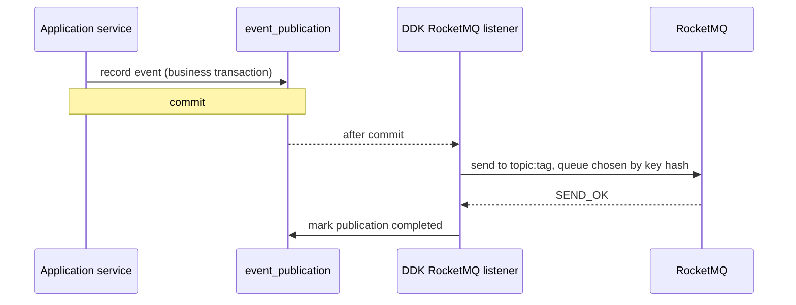

# DDK Event Starter

Publishes the domain events that aggregate roots collect, and hands the ones marked `@IntegrationEvent` to Spring Modulith for reliable delivery outside the process.

```text
aggregate.registerEvent(e) ──► repository save ──► DomainEventPublisher ──► Spring ApplicationEventPublisher
                                                                              │
             in-process   @TransactionalEventListener(AFTER_COMMIT) ◄──────────┤
             out-of-process (@IntegrationEvent + Spring Modulith)  ◄──────────┘
                            recorded in event_publication in the same transaction,
                            sent to Kafka / AMQP / JMS / Spring Messaging after commit
```

## Usage

```xml
<dependency>
    <groupId>com.ddk</groupId>
    <artifactId>ddk-event-starter</artifactId>
</dependency>
```

`GenericRepositoryImpl` publishes an aggregate's events after a successful write. Subscribers use `@TransactionalEventListener(phase = AFTER_COMMIT)`, so a rolled-back transaction notifies no one.

## Integration events

Mark a domain event that other services need, and name its destination:

```java
@IntegrationEvent(value = "user-events", key = "userId", id = "eventId")
public record UserRegisteredEvent(UUID eventId, UserId userId, String username, Instant occurredOn) implements DomainEvent {
}
```

The annotation lives in `com.ddk.core.domain` and is plain JDK, so the domain layer still depends on no framework. To deliver the events, add Spring Modulith's JDBC registry and a broker module:

```xml
<dependency>
    <groupId>org.springframework.modulith</groupId>
    <artifactId>spring-modulith-starter-jdbc</artifactId>
</dependency>
<dependency>
    <groupId>org.springframework.modulith</groupId>
    <artifactId>spring-modulith-events-kafka</artifactId>   <!-- or -amqp, -jms, -messaging -->
</dependency>
```

The Modulith versions are managed by the DDK BOM.

| Step | Behavior |
|---|---|
| Publish | The event is written to `event_publication` in the business transaction. It shares the `DataSource` and transaction with MyBatis-Plus, so a rollback leaves no record |
| Deliver | After commit, Modulith sends the event to `value()`: a Kafka topic, an AMQP exchange, a JMS destination or a `MessageChannel` bean |
| Key | `key()` names a no-argument accessor; a typed identifier contributes its raw value. Messages with the same key go to the same partition; see [Ordering](#ordering) for what that does and does not guarantee |
| Event ID | `id()` names an accessor whose value goes into the `ddk-event-id` header. It must be part of the event, not generated at delivery time, so that a resubmitted event keeps the same ID |
| Failure | A failed delivery stays in `event_publication` and can be resubmitted through Modulith's `IncompleteEventPublications` / `FailedEventPublications` |
| Payload | Typed identifiers are written as raw JSON values, e.g. `"userId":42`, by the `IdentifierJacksonModule` this starter registers |

If the application declares its own `EventExternalizationConfiguration`, DDK's selection backs off.

### Publish inside a transaction

Integration events leave through the transaction: recorded when published, delivered after the commit. Published without a transaction, an event is never delivered, and Spring Modulith still writes a publication record that stays incomplete. DDK checks at the moment of publishing and, by default, throws:

```text
IllegalStateException: com.acme.order.OrderPaid was published outside a transaction and will not be delivered:
publish integration events inside the transaction that changes the data, for example from a @Transactional service method
```

The check runs before Modulith records the event, so a failed publication leaves nothing behind. `ddk.event.outside-transaction=warn` logs instead of throwing, and `ignore` restores the old silence; with either, the incomplete record is written as before.

### RocketMQ

Spring Modulith has no RocketMQ module, so this starter provides one. Add the client instead of a Modulith broker module, and point it at a NameServer:

```xml
<dependency>
    <groupId>org.apache.rocketmq</groupId>
    <artifactId>rocketmq-client</artifactId>   <!-- version managed by the DDK BOM -->
</dependency>
```

```yaml
ddk:
  event:
    rocketmq:
      name-server: localhost:9876
```



| Aspect | Behavior |
|---|---|
| Target | `value()` is `topic` or `topic:tag`, the same convention as rocketmq-spring |
| Key | Messages with a key go to a queue chosen by the key's hash, so one aggregate's events share a queue (see [Ordering](#ordering)); the key is also set as the message keys for lookup in the console |
| Headers | `ddk-event-type`, `ddk-event-version` and `ddk-event-id` become user properties; read them with `MessageExt.getUserProperty(...)` |
| Payload | JSON from the application's `JsonMapper`; `String` and `byte[]` payloads are sent as they are |
| Failure | Any status other than `SEND_OK` fails the delivery, so the publication stays incomplete and can be resubmitted |
| Producer | An application `DefaultMQProducer` bean, such as the one rocketmq-spring registers, wins; otherwise DDK creates one from `ddk.event.rocketmq.*` |

The listener runs in Modulith's default listener mode and backs off when `spring.modulith.events.externalization.enabled=false` or `mode=outbox`. A Testcontainers test runs it against a real broker.

### Ordering

A key puts one aggregate's events into the same partition or queue, and the broker keeps the order in which they arrive there. It does not make them arrive in the order they were committed.

Delivery runs after commit on Spring's task executor, which is a thread pool by default. Two events committed shortly after each other are sent by two threads, and the second can reach the broker first. A test in this module saw three events of one aggregate arrive in reverse order.

| If you need | Do |
|---|---|
| Events of one aggregate in commit order | Set `spring.task.execution.pool.core-size=1`, so deliveries leave one at a time in the order they were submitted. This limits delivery throughput, and it does not hold with virtual threads enabled, where each delivery gets its own thread |
| Throughput | Keep the pool, and make consumers independent of order: carry the aggregate version or enough state in the event, and ignore or compensate for events that arrive late |

Resubmitting failed publications changes the order as well, so a consumer that breaks on reordering is fragile either way. The `ddk-mall` example takes the second approach: when a reservation arrives for an order that is already cancelled, the order context publishes the cancellation again.

## Consuming events

Declare a consumer as a bean. DDK subscribes, decodes the payload, reads the contract headers and, on request, deduplicates.

```java
@Component
public class OrderPlacedConsumer implements IntegrationEventConsumer<OrderPlacedPayload> {

    @Override
    public String group() {
        return "inventory";
    }

    @Override
    public String source() {
        return "order-events:placed";   // same form as @IntegrationEvent(value): topic or topic:tag
    }

    @Override
    public Class<OrderPlacedPayload> payloadType() {
        return OrderPlacedPayload.class;
    }

    @Override
    public void handle(ReceivedEvent<OrderPlacedPayload> event) {
        inventoryService.reserve(event.eventId(), event.payload());
    }
}
```

- A consumer is an entry point like a controller: put it in the adapter layer and call an application service.
- The payload type belongs to the consumer. It is the consumer's own copy of the publisher's contract with only the fields it uses, so the consumer does not depend on the publisher's classes.
- `ReceivedEvent` carries `eventId`, `type` and `version` from the `ddk-event-*` headers.
- Delivery is at least once. When `handle` throws, the message is delivered again.
- `idempotent()` returning `true` wraps `handle` in `IdempotentConsumer`, keyed by the event ID. It needs `ddk.event.inbox.enabled=true` and an event ID declared by the publisher; otherwise startup or the first message fails with a message that says so.

Where the messages come from:

| Source | Enabled by | Behavior |
|---|---|---|
| RocketMQ | `rocketmq-client` on the classpath and `ddk.event.rocketmq.name-server` | One consumer per group, subscribed to the group's topics and tags. Orderly consumption by default: a failed message suspends its queue and is retried, and later messages do not overtake it |
| In-process | `ddk.event.local-delivery.enabled=true` | For local development and tests without a broker. After commit the event is serialized and handed to the consumers of the same application on a single thread, through the same decoding. Nothing is persisted and failures are only logged |
| Anything else | Your own listener | Call `IntegrationEventDispatcher.dispatch(group, topic, tag, headers, json)` from a Kafka, AMQP or JMS listener to reuse decoding, headers and deduplication |

Do not put `idempotent()` on a consumer whose work must take a lock before its transaction starts. The inbox opens the transaction before `handle` runs, which would put the lock inside it. In that case call `IdempotentConsumer` yourself in the application service, inside the lock and inside the transaction.

## Tracing and metrics

Publishing and consuming are Micrometer observations, so they work with whatever the application already has and do nothing when it has no `ObservationRegistry`.

| Observation | When | Tags |
|---|---|---|
| `ddk.event.publish` | An event is sent to RocketMQ, or handed to local delivery | `messaging.destination.name` |
| `ddk.event.consume` | A message is processed by the consumers of one group | `messaging.destination.name`, `messaging.consumer.group.name` |

With tracing on the classpath, the publishing side writes the trace context into the message headers and the consuming side continues from it. One request that travels through several services, or several contexts of one application, is a single trace.

Two things to know:

- Events are sent on the task executor after the commit. The trace only reaches that thread if the context is propagated to it. `ddk-tracer-starter` sets this up; without it, declare a `ContextPropagatingTaskDecorator` bean yourself.
- An event that is resubmitted later, after a failed delivery or a restart, starts a new trace. The original context is not stored with the publication record.

A listener for another broker gets the consuming side for free by calling `IntegrationEventDispatcher.dispatch` with the message headers.

## Event contracts

Every delivered integration event carries contract headers:

| Header | Source | Purpose |
|---|---|---|
| `ddk-event-type` | `type()`, defaults to the simple class name | Consumers dispatch on this stable name, not on the Java class, so moving or renaming the class does not break them. Put the old name in `type()` when renaming |
| `ddk-event-version` | `version()`, defaults to `1` | Which shape of the payload this is |
| `ddk-event-id` | `id()` accessor | Deduplication, see below |

Evolution rules:

```text
same version     add optional fields only; consumers must ignore fields they don't know
breaking change  remove / rename a field, change its meaning or type
                 → new event class with version = N + 1 and the same type()
                 → publish both versions until every consumer has moved
                 → then remove the old one
```

At startup the starter scans the application's packages for `@IntegrationEvent` classes and fails fast when a declaration is wrong:

- `key()` or `id()` does not name a no-argument accessor
- `version()` is below 1 or the target is blank
- two classes declare the same type and version

Without this check a typo would surface only after commit, when delivery fails and the publication is left `FAILED`.

## Idempotent consumers

Delivery is at least once, so a consumer can see the same message twice. `IdempotentConsumer` runs a handler only once per consumer and message ID:

```java
@KafkaListener(topics = "user-events")
void on(UserRegisteredEvent event, @Header("ddk-event-id") String eventId) {
    idempotentConsumer.handle("welcome-mail", eventId, () -> mailService.sendWelcome(event.userId()));
}
```

With RocketMQ, read the ID from the message's user properties: `message.getUserProperty("ddk-event-id")`.

```text
handle(consumer, messageId, handler)            joins the caller's transaction, or starts one
  savepoint: INSERT (consumer, message_id)       primary key conflict → roll back to savepoint, return false
  handler.run()                                  throws → the whole transaction, including the insert, rolls back
  return true
```

- The insert and the handler's own writes share one transaction. A failed handler leaves the message unprocessed, so a redelivery runs it again.
- The savepoint matters on PostgreSQL, which aborts the whole transaction after a failed statement. A duplicate rolls back only to the savepoint, and the caller's other writes still commit. A Testcontainers test verifies this.
- `purgeOlderThan(Duration)` removes old records. Keep them longer than the broker's longest redelivery window.

Enable it with `ddk.event.inbox.enabled=true`. It needs a `JdbcTemplate` and a transaction manager, and creates `ddk_processed_message` with `CREATE TABLE IF NOT EXISTS`, which works on MySQL, PostgreSQL and H2. On other databases, or when a migration tool owns the schema, create the table yourself and set `initialize-schema=false`:

```sql
CREATE TABLE ddk_processed_message (
    consumer     VARCHAR(200) NOT NULL,
    message_id   VARCHAR(200) NOT NULL,
    processed_at TIMESTAMP    NOT NULL,
    PRIMARY KEY (consumer, message_id)
);
```

## Configuration

| Property | Default | Description |
|---|---|---|
| `ddk.event.enabled` | `true` | Register the Spring-backed `DomainEventPublisher` |
| `ddk.event.inbox.enabled` | `false` | Register `IdempotentConsumer` |
| `ddk.event.inbox.table` | `ddk_processed_message` | Processed message table |
| `ddk.event.inbox.initialize-schema` | `true` | Create the table on startup |
| `ddk.event.rocketmq.name-server` | | NameServer addresses, separated by `;`. Setting it makes DDK create the producer |
| `ddk.event.rocketmq.producer-group` | `ddk-event-producer` | Producer group of that producer |
| `ddk.event.rocketmq.send-timeout` | `3s` | Timeout of one send |
| `ddk.event.rocketmq.consumer.enabled` | `true` | Consume from RocketMQ when the application declares consumers |
| `ddk.event.rocketmq.consumer.orderly` | `true` | Orderly consumption; `false` consumes concurrently and redelivers failed messages individually |
| `ddk.event.outside-transaction` | `fail` | What to do when an integration event is published outside a transaction: `fail` throws where it is published, `warn` logs, `ignore` stays silent |
| `ddk.event.local-delivery.enabled` | `false` | Deliver integration events in-process to the consumers of the same application; development and tests only |
| `spring.modulith.events.*` | Spring Modulith | Registry schema, republishing on restart, completion mode, staleness |
